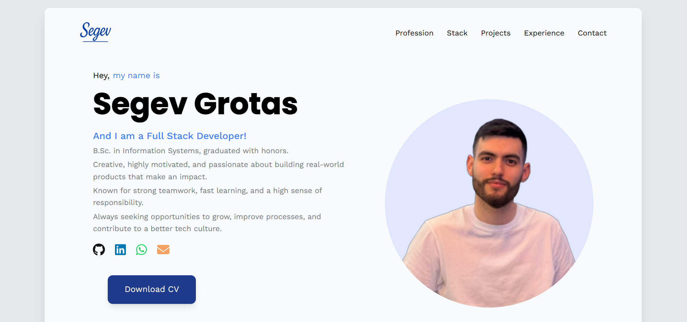

# 🧑‍💻 Segev Grotas – Portfolio Landing Page

A clean, responsive landing page built to present my professional identity, showcase my tech stack, and provide easy access to my CV and credentials.  
This portfolio is designed with hiring managers in mind – clear, fast, and to the point.

## 🌍 Live Demo

👉 [https://segevgr.github.io/portfolio-web](https://segevgr.github.io/portfolio-web)

## 📄 Available Downloads

| Resource                  | Description                         |
| ------------------------- | ----------------------------------- |
| CV                        | Updated PDF resume                  |
| Certificate of Excellence | Recognition of academic performance |

> Both files are available as buttons on the landing page.

## ✨ Features

- **Hero Section**: Brief self-intro with professional title
- **Tech Stack Grid**: Highlights top tools & languages I work with
- **Reusable Components**:
  - `GenericButton` for consistent UI
  - `FadeOnScroll` for subtle animations
- **Centralized Styling**: Custom colors defined in `tailwind.config.js`
- **Responsive Design**: Looks great on mobile and desktop
- **Accessibility-Friendly**: High contrast and clear font sizes

## 💻 Tech Stack

| Layer     | Technology                      |
| --------- | ------------------------------- |
| Frontend  | React                           |
| Styling   | TailwindCSS                     |
| Icons     | FontAwesome                     |
| Animation | Framer Motion                   |
| Carousel  | SwiperJS                        |
| Colors    | Defined in `tailwind.config.js` |

## 🧩 Component Architecture

| Component       | Purpose                                               |
| --------------- | ----------------------------------------------------- |
| `HeroSection`   | Landing headline with intro text                      |
| `TechStackGrid` | Displays key technologies                             |
| `GenericButton` | Reusable CTA button with `classStyle` + `style` props |
| `FadeOnScroll`  | Simple scroll animation wrapper                       |
| `Footer`        | Contact links and social media icons                  |

## ⚙️ How to Run Locally

```bash
git clone https://github.com/segevGr/portfolio-web.git
cd portfolio-web

npm install
npm start
```

> Runs on `http://localhost:3000` by default.

## 📸 Screenshots

### 🧑‍🎤 Hero Section



## 🧠 Design Philosophy

- **Minimalistic yet informative** – every element has a purpose.
- **Fast-loading** – optimized without heavy libraries or images.
- **Interviewer-friendly** – clear structure and clickable assets.

## 👨‍💼 About Me

Hi, I’m **Segev Grotas** – a full-stack developer with a passion for clean code and meaningful user experiences.  
Previously a Jira developer at Elbit Systems, currently seeking my next impactful role in React or mobile development.

> Built as part of my self-presentation for technical interviews.  
> Feel free to fork or get inspired 🙂

---

Made with ❤️ by [Segev Grotas](https://github.com/segevGr)
